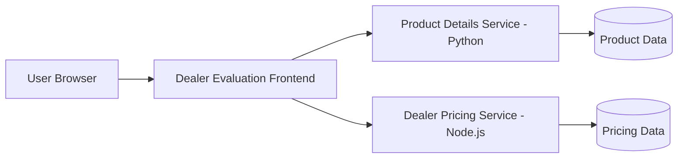

# Dealer Evaluation Microservices Deployment

<p align="center">
   
</p>

<p align="center">
   <a href="https://github.com/arshchouhan/devops-capstone-project/actions/workflows/ci-build.yaml">
      
   </a>
</p>

Production-ready, cloud-deployed microservices system that combines a Python Product Details API, a Node.js Dealer Pricing API, and a responsive JavaScript frontend on IBM Code Engine.

## Project Snapshot

Dealer Evaluation Microservices Deployment | GitHub | Mar 2026

- Engineered and deployed a full-stack microservices application by integrating Product Details (Python), Dealer Pricing (Node.js), and Dealer Evaluation Frontend on IBM Code Engine.
- Configured frontend-to-backend API communication by replacing placeholder endpoints with deployed service URLs, enabling dynamic product loading, dealer listing, and real-time pricing.
- Delivered a production-ready distributed system with seamless multi-service interaction, automated cloud deployment, and responsive UI behavior.

## Why This Project Stands Out

- Multi-language microservices architecture with clean service boundaries.
- Real API wiring between frontend and independent backend services.
- Cloud-native deployment workflow on IBM Code Engine.
- Strong distributed-systems behavior with responsive end-user experience.

## Architecture



Each service is independently deployable and communicates over REST APIs, allowing modular scaling and faster iteration.

## Technology Stack

| Layer | Technologies |
|---|---|
| Backend Services | Python, Node.js |
| Frontend | HTML, JavaScript |
| Platform | IBM Code Engine |
| Integration | Microservices, REST APIs |

## Visual Walkthrough

### Core Experience

<p align="center">
   
   
</p>

### Real-Time Pricing and Service Flow

<p align="center">
   
   
</p>

### Cloud Deployment on IBM Code Engine

<p align="center">
   
</p>

### Complete Screenshot Gallery

<details>
  <summary>View all 34 screenshots</summary>

<p align="center">
   
   
   
   
</p>

<p align="center">
   
   
   
   
</p>

<p align="center">
   
   
   
   
</p>

<p align="center">
   
   
   
   
</p>

<p align="center">
   
   
   
   
</p>

<p align="center">
   
   
   
   
</p>

<p align="center">
   
   
   
   
</p>

<p align="center">
   
   
   
   
</p>

<p align="center">
   
   
</p>

</details>

## Quick Start

```bash
git clone https://github.com/arshchouhan/devops-capstone-project.git
cd devops-capstone-project
```

Build and deploy each service using the Docker and pipeline assets available in this repository.

## Repository Highlights

- `service/` contains the core accounts service implementation.
- `service/tests/` includes API and behavior tests.
- `Dockerfile` provides container build support.
- `requirements.txt` defines Python dependencies.

## License

This project is licensed under the MIT License.
