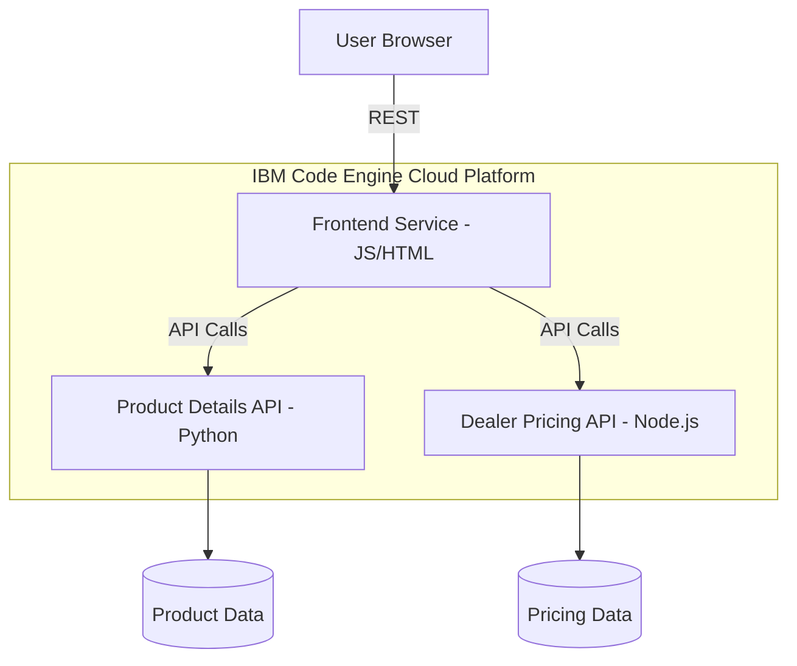

# 🚀 Dealer Evaluation Microservices Platform

<p align="center">
   
</p>

<p align="center">
   <a href="https://github.com/arshchouhan/devops-capstone-project/actions/workflows/ci-build.yaml">
      
   </a>
   
   
   
</p>

---

## 📖 Overview

This repository hosts a **production-grade microservices ecosystem** deployed on **IBM Code Engine**. It demonstrates a modern cloud-native architecture, integrating multiple backend languages with a responsive frontend to deliver a seamless dealer evaluation and pricing experience.

### 🏗️ Architecture at a Glance



---

## ✨ Key Achievements

- **Full-Stack Microservices Integration**: Successfully wired independent Python (Product Details) and Node.js (Dealer Pricing) services with a JavaScript frontend.
- **Cloud-Native Deployment**: Leveraged IBM Code Engine for serverless container orchestration, ensuring scalability and high availability.
- **Dynamic API Communication**: Transitioned from static placeholders to live, cross-service REST communication.
- **Production DevOps Lifecycle**: Implemented a complete flow from local development to containerized build and cloud deployment.

---

## 🛠️ Technology Stack

| Layer | Technologies |
|---|---|
| **Frontend** | HTML5, CSS3, Vanilla JavaScript |
| **Backend (API 1)** | Python, Flask/FastAPI |
| **Backend (API 2)** | Node.js, Express |
| **Infrastructure** | IBM Cloud, IBM Code Engine |
| **Containers** | Docker, IBM Container Registry |
| **Integration** | RESTful APIs, Microservices Architecture |

---

## 📸 Visual Journey: From Setup to Production

The following walkthrough illustrates the complete lifecycle of the project, categorized by functional phases.

### 🔹 Phase 1: Infrastructure & Environment Setup
Initial configuration of the IBM Cloud environment and Code Engine serverless projects.

<p align="center">
   
   
   
</p>

### 🔹 Phase 2: Registry & Secret Configuration
Configuring secure access to the IBM Container Registry and managing application secrets.

<p align="center">
   
   
   
</p>

### 🔹 Phase 3: Microservices Deployment
Deploying the independent backend services and the unified frontend application.

<p align="center">
   
   
   
</p>

### 🔹 Phase 4: Scaling & Monitoring
Managing application revisions, traffic splitting, and real-time instance monitoring.

<p align="center">
   
   
   
</p>

### 🔹 Phase 5: The Final Platform
The successfully integrated dealer evaluation platform in action.

<p align="center">
   
   
</p>

---

## 📂 Full Asset Gallery

<details>
<summary><b>Click to view all 34 project screenshots</b></summary>

<p align="center">
   
   
   
   
</p>

<p align="center">
   
   
   
   
</p>

<p align="center">
   
   
   
   
</p>

<p align="center">
   
   
   
   
</p>

<p align="center">
   
   
   
   
</p>

<p align="center">
   
   
   
   
</p>

<p align="center">
   
   
   
   
</p>

<p align="center">
   
   
   
   
</p>

<p align="center">
   
   
</p>

</details>

---

## 🚀 Getting Started

### Prerequisites

- [Docker](https://www.docker.com/) installed.
- [IBM Cloud CLI](https://cloud.ibm.com/docs/cli?topic=cli-install-ibmcloud-cli) with Code Engine plugin.
- Python 3.9+ and Node.js 16+.

### Quick Run

```bash
# Clone the repository
git clone https://github.com/arshchouhan/devops-capstone-project.git
cd devops-capstone-project

# Deploy services (refer to individual service directories for specific build instructions)
```

## 📜 License

This project is licensed under the MIT License - see the [LICENSE](LICENSE) file for details.

---
<p align="center">Developed as part of the IBM DevOps Capstone Project</p>
